# GameZone Unicesar – Layered Architecture

## Integrated Layer Diagram

```mermaid
flowchart TB

    %% =========================
    %% UI LAYER
    %% =========================

    subgraph UI["UI Layer"]
        Main["Main"]
        ConsoleMenu["ConsoleMenu"]
    end

    %% =========================
    %% SERVICE LAYER
    %% =========================

    subgraph SERVICE["Service Layer"]
        PersonService["PersonService"]
        ProductService["ProductService"]
        AccessoryService["AccessoryService"]
        PromotionService["PromotionService"]
        SaleService["SaleService"]
        ReturnService["ReturnService"]
        WarrantyService["WarrantyService"]
    end

    %% =========================
    %% PERSISTENCE LAYER
    %% =========================

    subgraph PERSISTENCE["Persistence Layer"]
        PersonRepository["PersonRepository"]
        ProductRepository["ProductRepository"]
        AccessoryRepository["AccessoryRepository"]
        PromotionRepository["PromotionRepository"]
        SaleRepository["SaleRepository"]
        ReturnRepository["ReturnRepository"]
        WarrantyRepository["WarrantyRepository"]
    end

    %% =========================
    %% MODEL LAYER
    %% =========================

    subgraph MODEL["Model Layer"]
        Person["Person"]
        Client["Client"]
        Seller["Seller"]

        Product["Product"]
        VideoGame["VideoGame"]
        Console["Console"]

        Accessory["Accessory"]
        Controller["Controller"]
        Cable["Cable"]
        Memory["Memory"]

        Promotion["Promotion"]
        PercentageDiscount["PercentageDiscount"]
        CategoryDiscount["CategoryDiscount"]
        BulkPurchaseDiscount["BulkPurchaseDiscount"]

        Sale["Sale"]
        Return["Return"]

        Warranty["Warranty"]
        BasicWarranty["BasicWarranty"]
        ExtendedWarranty["ExtendedWarranty"]
    end

    %% =========================
    %% UI → SERVICE
    %% =========================

    Main --> ConsoleMenu

    ConsoleMenu --> PersonService
    ConsoleMenu --> ProductService
    ConsoleMenu --> AccessoryService
    ConsoleMenu --> PromotionService
    ConsoleMenu --> SaleService
    ConsoleMenu --> ReturnService
    ConsoleMenu --> WarrantyService

    %% =========================
    %% SERVICE → PERSISTENCE
    %% =========================

    PersonService --> PersonRepository
    ProductService --> ProductRepository
    AccessoryService --> AccessoryRepository
    PromotionService --> PromotionRepository
    SaleService --> SaleRepository
    ReturnService --> ReturnRepository
    WarrantyService --> WarrantyRepository

    %% =========================
    %% SERVICE → MODEL
    %% =========================

    PersonService --> Person
    ProductService --> Product
    AccessoryService --> Accessory
    PromotionService --> Promotion
    SaleService --> Sale
    ReturnService --> Return
    WarrantyService --> Warranty

    %% =========================
    %% CROSS-SERVICE INTEGRATION
    %% =========================

    SaleService --> ProductService
    SaleService --> PromotionService
    SaleService --> WarrantyService

    ReturnService --> SaleService
    ReturnService --> AccessoryService
    ReturnService --> WarrantyService

    %% =========================
    %% PERSISTENCE → MODEL
    %% =========================

    PersonRepository --> Person
    ProductRepository --> Product
    AccessoryRepository --> Accessory
    PromotionRepository --> Promotion
    SaleRepository --> Sale
    ReturnRepository --> Return
    WarrantyRepository --> Warranty

    %% =========================
    %% MODEL HIERARCHIES
    %% =========================

    Person --> Client
    Person --> Seller

    Product --> VideoGame
    Product --> Console

    Accessory --> Controller
    Accessory --> Cable
    Accessory --> Memory

    Promotion --> PercentageDiscount
    Promotion --> CategoryDiscount
    Promotion --> BulkPurchaseDiscount

    Warranty --> BasicWarranty
    Warranty --> ExtendedWarranty

```



## Layer Responsibilities

### UI Layer

Responsible for application startup and user interaction through the console.

- `Main`
- `ConsoleMenu`

### Service Layer

Contains the business logic and coordinates the different system modules.

- `PersonService`
- `ProductService`
- `AccessoryService`
- `PromotionService`
- `SaleService`
- `ReturnService`
- `WarrantyService`

### Persistence Layer

Provides persistence operations for the system entities.

- `PersonRepository`
- `ProductRepository`
- `AccessoryRepository`
- `PromotionRepository`
- `SaleRepository`
- `ReturnRepository`
- `WarrantyRepository`

### Model Layer

Contains the domain classes and their inheritance hierarchies.

- Person hierarchy
- Product hierarchy
- Accessory hierarchy
- Promotion hierarchy
- Sale
- Return
- Warranty hierarchy

## Integration Flow

The integrated architecture follows this dependency direction:

```text
UI
 ↓
Service
 ↓
Persistence
 ↓
Model

```

The service layer coordinates the integrated functionality.

SaleService coordinates product resolution, promotions, and warranties during sale registration.

ReturnService coordinates sale validation, accessory stock restoration, and warranty cancellation during return processing.

The model layer remains independent from persistence and service layers.