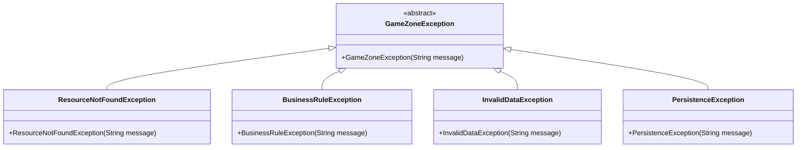

# Exception Handling Class Diagram

```mermaid
classDiagram
    class GameZoneException {
        <<abstract>>
        +GameZoneException(String message)
    }

    class ResourceNotFoundException {
        +ResourceNotFoundException(String message)
    }

    class BusinessRuleException {
        +BusinessRuleException(String message)
    }

    class InvalidDataException {
        +InvalidDataException(String message)
    }

    class PersistenceException {
        +PersistenceException(String message)
    }

    GameZoneException <|-- ResourceNotFoundException
    GameZoneException <|-- BusinessRuleException
    GameZoneException <|-- InvalidDataException
    GameZoneException <|-- PersistenceException
```
