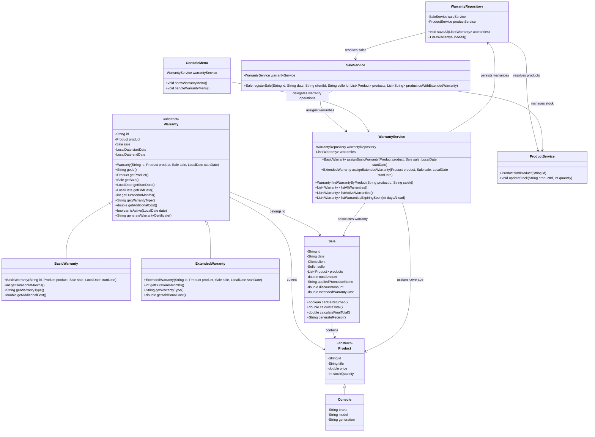

# Warranty Module Class Diagram

## Updated Class Diagram

## Layer Integration

- `Warranty`, `BasicWarranty`, and `ExtendedWarranty` belong to the model layer.
- `WarrantyRepository` belongs to the persistence layer.
- `WarrantyService` belongs to the service layer.
- `ConsoleMenu` belongs to the ui layer.
- `SaleService` integrates warranty assignment into the existing sales flow.
- `WarrantyService` coordinates warranty assignment and warranty queries.
- `WarrantyRepository` is responsible for persistence in `data/warranties.csv`.