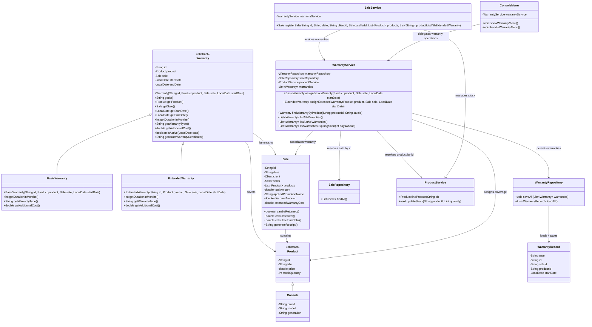

# Warranty Module Class Diagram

## Updated Class Diagram

## Layer Integration

- `Warranty`, `BasicWarranty`, and `ExtendedWarranty` belong to the model layer.
- `WarrantyRepository` belongs to the persistence layer and has no dependency on any service; it only persists and loads raw `WarrantyRecord` identifiers (sale id, product id).
- `WarrantyService` belongs to the service layer. It depends on `WarrantyRepository`, `SaleRepository`, and `ProductService`, resolving `WarrantyRecord` entries into real `Warranty` objects by looking up the referenced `Sale` and `Product`.
- `ConsoleMenu` belongs to the ui layer.
- `SaleService` integrates warranty assignment into the existing sales flow, receiving `WarrantyService` through constructor injection.
- `WarrantyService` coordinates warranty assignment and warranty queries.
- `WarrantyRepository` is responsible for persistence in `data/warranties.csv`.

## Fix A2: Removing the Circular Dependency

Before this fix, the object graph formed a cycle: `SaleService → WarrantyService → WarrantyRepository → SaleService`, since `WarrantyRepository` needed `SaleService` to resolve sale references when loading warranties from disk, while `SaleService` needed `WarrantyService` to assign warranties during sale registration. This cycle made pure constructor injection impossible in `Main`, forcing a setter-based workaround.

The fix breaks the cycle by changing what `WarrantyRepository` stores and who resolves references:

- `WarrantyRepository` no longer resolves anything; it just reads/writes the raw `saleId` and `productId` of each warranty as a `WarrantyRecord`.
- `WarrantyService` takes over reference resolution. It receives `SaleRepository` (not `SaleService`) and `ProductService` by constructor, and reconstructs `Warranty` objects from the loaded `WarrantyRecord` list.
- `SaleService` now receives `WarrantyService` directly through its constructor instead of a `setWarrantyService` setter.
- In `Main`, `WarrantyRepository` and `WarrantyService` are now built **before** `SaleService`, since neither depends on it anymore. `SaleService` is built last, receiving the already-constructed `WarrantyService`.

This removes the cycle entirely: `WarrantyService` now depends on `SaleRepository`, a class with no dependency on `SaleService` or `WarrantyService`, so the whole graph becomes a proper directed acyclic graph.